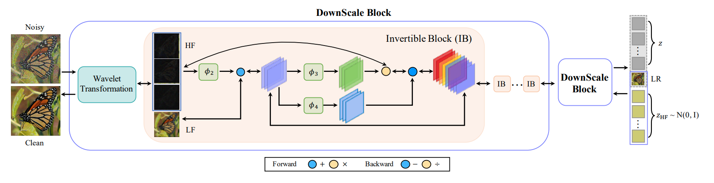

# **InvDN**

Invertible Denoising Network: A Light Solution for Real Noise Removal (CVPR 2021) 论文复现

官方源码：[https://github.com/Yang-Liu1082/InvDN](https://github.com/Yang-Liu1082/InvDN)

复现地址：[https://github.com/hnmizuho/InvDN_paddlepaddle](https://github.com/hnmizuho/InvDN_paddlepaddle)

## 1. 简介



InvDN利用可逆网络把噪声图片分成低解析度干净图片和高频潜在表示， 其中高频潜在表示中含有噪声信息和内容信息。由于可逆网络是无损的， 如果我们能够将高频表示中的噪声信息分离， 那么就可以将其和低解析度干净图片一起重构成原分辨率的干净图片。但实际上去除高频信息中的噪声是很困难的， 本文通过直接将带有噪声的高频潜在表示替换为在还原过程中从先验分布中采样的另一个表示，进而结合低解析度干净图片重构回原分辨率干净图片。本文所实现网络是轻量级的， 且效果较好。

## 2. 复现精度

验收标准：SIDD PSNR: 39.28

复现结果：SIDD PSNR: 39.29

## 3. 数据集、预训练模型、文件结构

### 数据集

1. 下载 SIDD-Medium [训练集](https://www.eecs.yorku.ca/~kamel/sidd/dataset.php) 放在  `./SIDD_Medium_Srgb/Data` 下。

2. 运行如下命令生成训练集patches

```code
python generate_patches_sidd.py
```
所生成的patches放在 `./SIDD_Medium_Srgb_Patches_512/train` 下。本文将patch划为 $512 \times 512$。

3. 本文训练时需要产生低分辨率版本的ground-truth，为了加速读取，需要事先遍历一遍训练集，产生的低分辨率图片将存储在`./SIDD_Medium_Srgb_Patches_512/train/LQ` 下。如果不进行该步骤，低分辨率图像会在训练时产生并存储，会严重拖慢IO。
使用如下命令来提前产生低分辨率版本的ground-truth：
```code
python generate_lq.py
```

4. 下载 SIDD [验证集](https://www.eecs.yorku.ca/~kamel/sidd/dataset.php)，即  `./ValidationNoisyBlocksSrgb.mat 和 ./ValidationGtBlocksSrgb.mat`。

5. 运行如下命令，从 $.mat$ 格式中提取出 $.png$ 格式的图片。
```code
python extract_valid_patches_sidd.py
```
所生成的 $.png$ 格式图片放在 `./SIDD_Valid_Srgb_Patches_256/valid` 下。


### 预训练模型

1. 官方预训练模型转换为paddle版本，放在 `./pretrained/InvDN_ResUnit_x4.pdparams`.
3. pytorch 的初始化参数转换为paddle版本，放在 `./pretrained/default_invdn.pdparams`
2. 笔者使用paddle复现的模型，放在 `./pretrained/model_best.pdparams`.

### 文件结构

```
MIRNet_Paddle
    |-- dataloaders
    |-- SIDD_Medium_Srgb_Patches_512
         |-- train                      # SIDD-Medium 训练数据
    |-- SIDD_Valid_Srgb_Patches_256
         |-- valid                      # SIDD 测试数据
    |-- SIDD_mini                       
         |-- train_mini                 # 小训练数据，用于TIPC测试
         |-- val_mini                   # 小测试数据，用于TIPC测试
    |-- experiments                     # 存放训练过程的日志和模型
    |-- test_tipc                       # TIPC: Linux GPU/CPU 基础训练推理测试
    |-- networks
         |-- InvDN_model.py             # InvDN模型代码
         |-- InvDN_model_oneForward.py  # InvDN模型代码，用于动转静
    |-- pretrained                      # 存放训好的模型
    |-- utils                           # 一些工具代码
    |-- predict_results                 # 小测试数据的去噪结果
    |-- config.py                       # 配置文件
    |-- export_model.py                 # 动转静导出代码
    |-- generate_lq.py                  # 生成低分辨率图片的代码
    |-- generate_patches_SIDD.py        # 生成patch的代码
    |-- extract_valid_patches_sidd.py   # 提取测试集的代码
    |-- LICENSE                         # LICENSE文件
    |-- losses.py                       # 损失函数
    |-- README.md                       # README.md文件
    |-- train.py                        # TIPC训练测试代码
    |-- infer.py                        # 模型推理代码
    |-- predict.py                      # 模型预测代码
    |-- test_denoising_sidd.py          # 测试SIDD数据上的指标
    |-- train_denoising_1card.py        # 单机单卡训练代码
    |-- train_denoising_4cards.py       # 单机多卡训练代码
    |-- training_1card.yml              # 单机单卡训练配置文件
    |-- training_4cards.py              # 单机多卡训练配置文件
```

## 4. 环境依赖

PaddlePaddle == 2.3.2
scipy == 1.9.1
scikit-image == 0.19.3
pyyaml == 6.0
opencv-ython == 1.0.0.14

## 5. 快速开始

由于本文模型类似于生成模型，且可逆过程类似于超分模型，所以对初始化参数非常敏感；需要修改paddle对卷积层的默认初始化方式。使用以下代码对卷积层进行初始化：
```python
def _init_weights(self):
    weight_attr = paddle.ParamAttr(initializer=paddle.nn.initializer.KaimingUniform(negative_slope=math.sqrt(5), nonlinearity='leaky_relu'))
    bias_attr = paddle.ParamAttr(initializer=paddle.nn.initializer.KaimingUniform(negative_slope=math.sqrt(5), nonlinearity='leaky_relu'))
    return weight_attr, bias_attr
```
或者也可以直接使用 Pytorch 随机初始化的模型参数，已经转换为paddle格式放在了 `./pretrained/default_invdn.pdparams`。本代码训练时默认读取 Pytorch 随机初始化的模型参数。

### 单机单卡

单机单卡使用 `training_1card.yml` 配置文件。

```shell
python train_denoising_1card.py
```

### 单机四卡

单机四卡使用 `training_4cards.yml` 配置文件。

```shell
python -m paddle.distributed.launch train_denoising_4cards.py
```

注意，为了保证总epoch数目和论文相同，我们需要确保 $ total\_batchsize*iter == 1gpus*14bs*600000iters$。同时 $batchsize$ 改变时也要确保 $batchsize/learning\_rate == 14/0.0002$ 。

笔者在使用单机四卡时，将单卡 $batchsize$ 设置为14，此时实际的总 $batchsize$ 应为14*4，需要将总 $iters$ 设置为为150000，且学习率扩大到8e-4。

### 日志读取

日志存储在了 `./experiments/` 文件夹下。注意作者原代码中，测试时使用了蒙特卡洛自集成以提高PSNR点数，而我们的日志中，在validation时记录的PSNR点数是没有做自集成的（为了速度）。只有在模型评估时打开自集成。
(日志是我在本地四卡训的，有两份日志因为中间断了一次从断点前接着训)

### 模型评估

在 SIDD 测试数据上作测试。

```
python test_denoising_sidd.py --weights ./pretrained/model_best.pdparams
```

输出如下：

```
PSNR: 39.29
SSIM: 0.956
```

达到了验收精度。

### 模型预测

在 SIDD 小验证集上作预测，可视化结果存放在 `results/` 文件夹下

```
python predict.py --weights ./pretrained/model_best.pdparams --data_path ./SIDD_mini/val_mini/ --result_dir ./predict_results/
```

输出为：

```
PSNR: 42.22
SSIM: 0.981
```

### 推理过程：

需要安装 reprod_log：

```
pip install reprod_log
```

模型动转静导出使用如下代码，注意由于本模型可逆网络的特殊性，InvDN的推理需要正向传播一次加逆向传播一次，为了适配动转静，需要将两次传播合入到一次forward中。
修改后的模型文件为networks/InvDN_model_oneForward.py; 此文件和原始模型共用权重。

```
python export_model.py --weights ./pretrained/model_best.pdparams --save-inference-dir ./export
```

最终在`./export/`文件夹下会生成下面的3个文件：

```
export
  |----model.pdiparams     : 模型参数文件
  |----model.pdmodel       : 模型结构文件
  |----model.pdiparams.info: 模型参数信息文件
```

模型推理运行如下命令。注意由于InvDN在逆向反推时需要生成随机噪声图，而动转静模型运行时不支持random，为了解决这个问题，我们需要提前在输入时cat上随机噪声，在forward中将噪声取出供逆向反推时使用。

```
python infer.py --model-dir ./export --use-gpu True --benchmark False --clean-dir ./SIDD_mini/val_mini/GT/0_0.PNG --noisy-dir ./SIDD_mini/val_mini/Noisy/0_0.PNG
```

输出结果为：

```
image_name: ./SIDD_mini/val_mini/Noisy/0_0.PNG, psnr: 42.34541098493242
```

## 6. TIPC

首先安装AutoLog（规范化日志输出工具）

```
pip install  https://paddleocr.bj.bcebos.com/libs/auto_log-1.2.0-py3-none-any.whl
```

在linux下，在主目录运行命令：

```
bash test_tipc/prepare.sh ./test_tipc/configs/InvDN/train_infer_python.txt 'lite_train_lite_infer'
bash test_tipc/test_train_inference_python.sh ./test_tipc/configs/InvDN/train_infer_python.txt 'lite_train_lite_infer'
```

出现以下输出，即TIPC成功。

```
Run successfully with command - python train.py --data_dir ./test_tipc/data/SIDD_mini/train_mini/ --val_dir ./test_tipc/data/SIDD_mini/val_mini/ --log_dir=./test_tipc/output/InvDN/norm_train_gpus_0 --iter=10   --batchSize=1! 

Run successfully with command - python predict.py --weights ./test_tipc/output/InvDN/norm_train_gpus_0/models/model_best.pdparams --data_path ./test_tipc/data/SIDD_mini/val_mini/!  

Run successfully with command - python export_model.py --weights ./test_tipc/output/InvDN/norm_train_gpus_0/models/model_best.pdparams --save-inference-dir=./test_tipc/output/InvDN/norm_train_gpus_0!  

Run successfully with command - python infer.py --use-gpu=True --model-dir=./test_tipc/output/InvDN/norm_train_gpus_0 --batch-size=1 --clean-dir=./test_tipc/data/SIDD_mini/val_mini/GT/0_0.PNG --noisy-dir=./test_tipc/data/SIDD_mini/val_mini/Noisy/0_0.PNG   > ./test_tipc/output/InvDN/python_infer_gpu_batchsize_1.log 2>&1 !  

Run successfully with command - python infer.py --use-gpu=False --model-dir=./test_tipc/output/InvDN/norm_train_gpus_0 --batch-size=1 --clean-dir=./test_tipc/data/SIDD_mini/val_mini/GT/0_0.PNG --noisy-dir=./test_tipc/data/SIDD_mini/val_mini/Noisy/0_0.PNG   > ./test_tipc/output/InvDN/python_infer_cpu_batchsize_1.log 2>&1 !  
```

## 7. LICENSE

本项目的发布受[Apache 2.0 license](https://github.com/PaddlePaddle/models/blob/release/2.2/community/repo_template/LICENSE)许可认证。

## 8. Acknowledgement

本项目代码框架借鉴了 [HINet](https://github.com/youngAt19/hinet_paddle.git) 和 [MIRNet](https://github.com/sldyns/MIRNetV2_paddle.git) 以及 [InvDN](https://github.com/Yang-Liu1082/InvDN), 非常感谢他们的工作。
